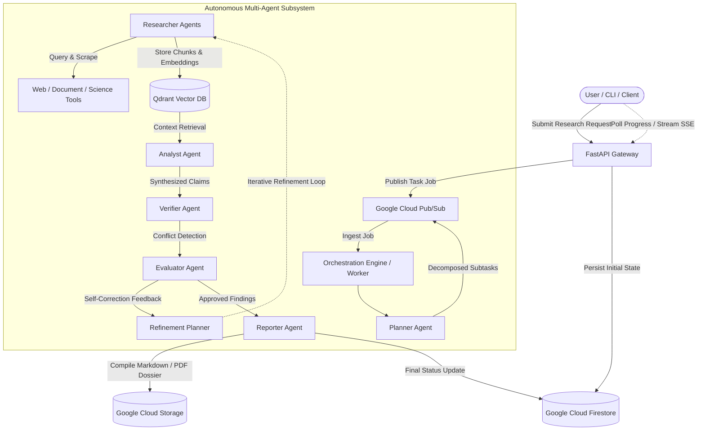

# ResearchMind

> **Autonomous Asynchronous Multi-Agent Research System**

[](https://github.com/Ankushh0027/ResearchMind/actions/workflows/ci.yml)
[](https://www.python.org/downloads/)
[](https://github.com/astral-sh/ruff)
[](https://mypy-lang.org/)
[](LICENSE)

---

## 1. What ResearchMind Is

**ResearchMind** is an autonomous, asynchronous research intelligence platform powered by specialized multi-agent collaboration, deep retrieval-augmented generation (RAG), dynamic self-correction loops, and automated rubric evaluation. It transforms complex, open-ended research inquiries into comprehensive, citation-backed, conflict-checked investigative dossiers.

Rather than relying on a single, monolithic LLM prompt that suffers from hallucinations and shallow synthesis, ResearchMind decomposes research goals into structured inquiry DAGs. It deploys parallel research agents to gather evidence, cross-examine contradicting claims, verify primary sources, and dynamically refine incomplete findings before generating publication-grade research reports.

---

## 2. High-Level Architecture



---

## 3. Operator CLI (`researchmind`)

ResearchMind includes a production-ready command line interface for operators, developers, and CI pipelines:

```bash
# 1. Health Probe
researchmind health

# 2. Submit Autonomous Research Run
researchmind submit "Evaluate zero-noise extrapolation in quantum error mitigation." \
  --tags academic quantum \
  --max-subtasks 6

# 3. Stream Real-Time Execution Events (SSE)
researchmind stream <run_id>

# 4. Inspect Real-Time Status & Key Findings
researchmind status <run_id> --full

# 5. Export Deliverables and Artifacts to Disk
researchmind export <run_id> --output-dir ./artifacts

# 6. Execute Golden Evaluation Benchmark Suite
researchmind benchmark --threshold 0.85
```

---

## 4. Local Execution & Docker Staging

### Local Virtual Environment
```bash
# Install package with all developer tools and CLI entrypoint
pip install -e ".[dev]"

# Run full test suite (811 unit, integration, and benchmark tests)
pytest

# Run linters and type checkers
ruff check .
ruff format --check .
python -m mypy --config-file pyproject.toml
```

### Docker Compose Multi-Service Stack
```bash
# Spin up API Gateway and Background Worker
docker compose up --build
```

---

## 5. Google Cloud Deployment (Terraform)

ResearchMind provides turnkey Infrastructure as Code under `infrastructure/terraform/`:

```bash
cd infrastructure/terraform
cp terraform.tfvars.example terraform.tfvars

# Initialize and deploy
terraform init
terraform plan
terraform apply
```

### Automated Deployment Scripts
```bash
# Deploy to Google Cloud Platform (Linux/macOS)
./scripts/deploy.sh <GCP_PROJECT_ID> [GCP_REGION]

# Deploy to Google Cloud Platform (PowerShell)
.\scripts\deploy.ps1 -ProjectId <GCP_PROJECT_ID>

# Post-Deployment Smoke Test
python scripts/smoke_test.py --url https://<your-cloud-run-api-url> --api-key <your-key>
```

---

---

## 6. Interactive Web Workspace (`frontend/`)

ResearchMind Phase 7.3 provides an interactive, modern web workspace:

```bash
# Start backend API and static web workspace
uvicorn app.api.app:create_app --factory --host 0.0.0.0 --port 8080 --reload

# Open in browser:
# http://localhost:8080/
```

### Features
- **Inquiry Launchpad**: Query submission with domain tags, task bounds, and constraint sliders.
- **Live Multi-Agent Pipeline**: Real-time SSE execution monitor (`Planner` → `Researcher` → `Analyst` → `Verifier` → `Evaluator` → `Reporter`).
- **Research Dossier Studio**: Interactive Executive Summary, Key Findings, Verified Claims, Contradiction Alerts, and Evaluation Rubric metrics.
- **Artifact Explorer**: Persistent artifact viewer and SHA-256 verified direct downloads.

---

## 7. Implemented Phases & Verification Baseline

- [x] **Phase 6.1**: Durable State & Checkpoint Persistence (Google Cloud Firestore)
- [x] **Phase 6.2**: Distributed Messaging & Task Distribution (Google Cloud Pub/Sub)
- [x] **Phase 6.3**: Live Gemini Intelligence Adapters & Structured Function Calling
- [x] **Phase 6.4**: Live Qdrant Vector Search + Tavily Web + arXiv Academic Integration
- [x] **Phase 6.5**: API Security, Sliding-Window Rate Limiting & SSRF Hardening
- [x] **Phase 6.6**: Durable Artifact Storage with Google Cloud Storage (GCS)
- [x] **Phase 6.7**: OpenTelemetry Distributed Tracing, Structured Metrics & Observability
- [x] **Phase 6.8**: Automated Evaluation Framework, Rubric Scoring & Golden Benchmark Suite
- [x] **Phase 6.9**: Autonomous Self-Correction, Dynamic Inquiry Refinement & Iterative Loop
- [x] **Phase 7.0**: Production Cloud Infrastructure, Operator CLI & Multi-Service Deployment Automation
- [x] **Phase 7.1**: Worker Leases, Heartbeat Supervision & Automatic Crash Recovery
- [x] **Phase 7.2**: Production API Security, SHA-256 Digest Auth & Tenant Isolation
- [x] **Phase 7.3**: Interactive Research Workspace & Live Multi-Agent Execution Studio
