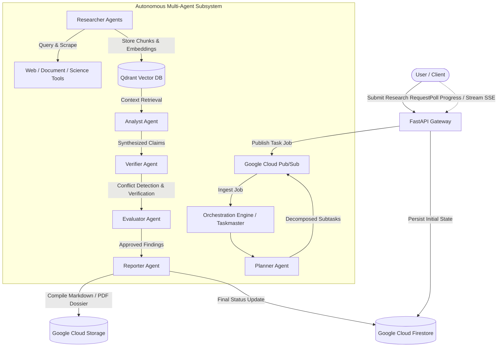

# ResearchMind

> **Autonomous Asynchronous Multi-Agent Research System**

[](https://github.com/researchmind/researchmind/actions/workflows/ci.yml)
[](https://www.python.org/downloads/)
[](https://github.com/astral-sh/ruff)
[](https://mypy-lang.org/)
[](LICENSE)

---

## 1. What ResearchMind Is

**ResearchMind** is an autonomous, asynchronous research intelligence platform powered by specialized multi-agent collaboration, deep retrieval-augmented generation (RAG), and rigorous automated verification. It transforms complex, open-ended research inquiries into comprehensive, citation-backed, conflict-checked investigative dossiers.

Rather than relying on a single, monolithic LLM prompt that suffers from hallucinations and shallow synthesis, ResearchMind decomposes research goals into structured inquiry trees. It deploys parallel research agents to gather evidence, cross-examine contradicting claims, verify primary sources, and generate publication-grade research reports.

---

## 2. The Problem It Solves

Modern knowledge workers, scientists, market analysts, and engineers face severe bottlenecks when conducting deep research:

- **Information Overload & Noise**: Sifting through hundreds of scientific papers, regulatory filings, earnings transcripts, and technical documentation is time-consuming.
- **Hallucinations & Ungrounded Claims**: Traditional chat-based AI tools often invent facts, misquote data, or synthesize misleading answers without verifiable evidence.
- **Unchecked Contradictions**: Different sources often present conflicting claims (e.g., competing benchmarks, opposing clinical results). Monolithic models smooth over or ignore these discrepancies.
- **Synchronous Execution Limits**: Deep multi-step research cannot fit within a single HTTP request timeout. It requires persistent background execution, state durability, and resilience against transient network failures.

---

## 3. The Hackathon-Focused Vision

ResearchMind is engineered to showcase what is possible when modern frontier models (**Google Gemini 2.5 Pro / Flash**) are coupled with **Google Cloud Platform (GCP)** serverless primitives and an **agentic micro-orchestration engine**:

- **Real Asynchronous Workflows**: Submit a research prompt, receive an execution handle, and monitor deep research progression via event-driven pub/sub streams.
- **Self-Evaluating & Conflict-Aware**: An independent Verifier and Evaluator agent inspect every synthesized finding, challenging assumptions and flagging contradictions before producing the final report.
- **Cloud-Native & Production-Ready**: Designed for zero-downtime scaling on Google Cloud Run, Cloud Pub/Sub, Firestore, and Cloud Storage.

---

## 4. High-Level Architecture



---

## 5. Planned Agent Workflow

ResearchMind coordinates specialized autonomous agents in a structured, observable pipeline:

1. **Planner Agent**: Decomposes high-level research objectives into focused sub-questions, dependency graphs, and targeted search strategies.
2. **Researcher Agent**: Executes targeted web, academic, and document searches, ingesting raw evidence, extracting quotes, and indexing semantic embeddings into Qdrant.
3. **Analyst Agent**: Synthesizes multi-source evidence, clusters related facts, and extracts core arguments.
4. **Verifier Agent**: Cross-references every claim against primary sources, detects contradictory evidence across sources, and computes confidence scores.
5. **Evaluator Agent**: Evaluates synthesis depth, coverage against the original research plan, and self-critiques draft sections for logical gaps.
6. **Reporter Agent**: Formats the verified findings into structured research dossiers with complete bibliographies and actionable executive summaries.

---

## 6. Async / Background Execution Concept

Deep research takes minutes, not milliseconds. ResearchMind separates request admission from task execution:

- **State Persistence**: Job states, task trees, and agent checkpoints are committed to **Google Cloud Firestore**.
- **Message-Driven Task Distribution**: Subtasks are published to **Google Cloud Pub/Sub** topics, allowing parallel worker instances to process sub-queries concurrently.
- **Crash Resilience & Idempotency**: If a worker process fails or restarts, the orchestration engine resumes tasks from the last verified state snapshot without repeating completed work.
- **Real-Time Client Updates**: Clients monitor run progress via Server-Sent Events (SSE) or polling backed by Firestore snapshots.

---

## 7. Planned Google Cloud Architecture

- **Google Cloud Run**: Serverless container runtime hosting the API Gateway and asynchronous agent worker pools with autoscaling.
- **Google Cloud Pub/Sub**: High-throughput message bus coordinating task dispatch, worker heartbeats, and workflow event streams.
- **Google Cloud Firestore**: Low-latency NoSQL database storing job runs, task trees, agent state snapshots, and verification audit trails.
- **Google Cloud Storage (GCS)**: Scalable object storage for uploaded reference documents and final compiled research artifacts.
- **Gemini API on Vertex AI / Google AI Studio**: High-capacity multi-modal reasoning and embedding models.
- **Google Cloud Logging & Cloud Monitoring**: Centralized structured logging and distributed tracing.

---

## 8. Development Setup

### Prerequisites

- **Python**: 3.11 or higher
- **Git**
- **Virtual Environment Tool**: `venv` or `uv`

### Installation

```bash
# 1. Clone repository
git clone https://github.com/researchmind/researchmind.git
cd researchmind

# 2. Create and activate a virtual environment
python -m venv .venv

# On Linux/macOS:
source .venv/bin/activate

# On Windows (PowerShell):
.venv\Scripts\Activate.ps1

# 3. Install dependencies in editable mode with development tools
pip install -e ".[dev]"

# 4. Copy environment configuration
cp .env.example .env
```

---

## 9. Testing & Quality Commands

```bash
# Run test suite
pytest

# Run linter checks
ruff check .

# Run code formatter check
ruff format --check .

# Run static type checking
mypy
```

---

## 10. Project Roadmap

- [x] **Phase 0: Repository & Architecture Foundation** *(Current)*
  - Package structure, typed configuration contracts, CI workflow, and architectural specifications.
- [ ] **Phase 1: Domain State Models & Execution Contracts**
  - Typed task models, state machine transitions, event schemas, and database interfaces.
- [ ] **Phase 2: RAG & Vector Memory Integration**
  - Qdrant integration, document chunking, and embedding pipelines.
- [ ] **Phase 3: Autonomous Agent Implementation**
  - Planner, Researcher, Analyst, Verifier, Evaluator, and Reporter agent implementations powered by Gemini.
- [ ] **Phase 4: Async Orchestration Engine**
  - Pub/Sub worker queue, retry policies, state recovery, and parallel task coordinator.
- [ ] **Phase 5: Cloud Deployment & API Surface**
  - FastAPI endpoints, Cloud Run manifests, and client interfaces.
