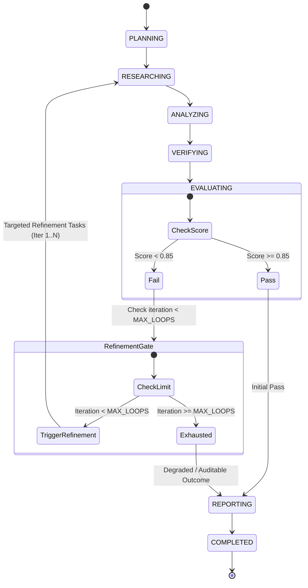

# Phase 6.9 — Autonomous Self-Correction, Dynamic Inquiry Refinement & Iterative Research Loop

## 1. Overview & Objective

Phase 6.9 closes the autonomous multi-agent evaluation feedback loop for ResearchMind. In previous phases (6.1–6.8), the execution pipeline followed a forward DAG from planning to reporting. When synthesis evaluation indicated factual gaps, unsupported assertions, low citation coverage, or unresolved contradictions, the run concluded with a degraded dossier.

Phase 6.9 introduces dynamic inquiry refinement and self-correction: when an `EvaluationReport` yields `passed = False` (or composite score $< 0.85$), the system autonomously derives targeted research tasks from the evaluator's critique, executes a bounded refinement cycle, merges new evidence, and re-evaluates before final delivery.

---

## 2. Refinement Lifecycle State Machine

---

## 3. Core Architecture & Components

### 3.1 Refinement Planner (`app.orchestration.refinement.py`)

The `RefinementPlanner` acts as an automated triage engine that parses `EvaluationReport` critiques into actionable, weighted `EvaluationDeficiency` records:

| Deficiency Type | Trigger Condition | Targeted Task Type | Assigned Role |
| :--- | :--- | :--- | :--- |
| `MISSING_TOPIC` | `completeness_score < 0.85` | `TaskType.WEB_SEARCH` | `RESEARCHER` |
| `UNSUPPORTED_CLAIM` | `unsupported_claim_rate > 0.15` | `TaskType.ACADEMIC_SEARCH` | `RESEARCHER` |
| `CITATION_DEFICIENCY` | `citation_coverage_score < 0.85` | `TaskType.ACADEMIC_SEARCH` | `RESEARCHER` |
| `UNRESOLVED_CONTRADICTION` | `contradiction_rate > 0.15` | `TaskType.DOC_ANALYSIS` | `RESEARCHER` |
| `Rubric Specific` | Rubric dimension score $< 0.80$ | `TaskType.WEB_SEARCH` | `RESEARCHER` |
| `LOW_QUALITY` | `overall_score < 0.85` (Fallback) | `TaskType.WEB_SEARCH` | `RESEARCHER` |

### 3.2 Iteration Semantics & Bounded Loops

1. **Deterministic Bounding**: Refinement cycles are strictly bounded by `MAX_REFINEMENT_LOOPS = 2` (configurable via `AppSettings`).
2. **Iteration Tracking**: Refinement is 1-indexed ($1 \le \text{iteration} \le \text{MAX\_REFINEMENT\_LOOPS}$).
3. **Graceful Exit**: If an iteration yields `new_eval_report.passed == True` (score $\ge 0.85$), the loop terminates immediately and proceeds to `ReporterWorker` for final publication.
4. **Exhaustion Handling**: If iterations reach the maximum limit without achieving score $\ge 0.85$, the worker terminates deterministically and generates a dossier flagged as degraded/unverified, preserving the evaluation feedback without claiming false compliance.

---

## 4. Evidence Merging & Lineage Preservation

- **Non-Destructive Accumulation**: New empirical findings, citations, claims, and evidence gathered during refinement cycles are appended to `all_task_outputs` alongside initial findings.
- **Node Provenance**: All subtasks generated during refinement carry `refinement_iteration: int` and `deficiency_type: str` in their `input_context`.
- **Token Accounting**: Token usage across each refinement cycle is summed into `context.total_token_usage`.

---

## 5. Cancellation Safety

Cancellation tokens (`CancellationToken`) are checked at critical boundaries:
1. Prior to entering a refinement cycle.
2. Between refinement subtask dispatches.
3. During DAG execution within `DAGExecutor`.

If cancellation is requested, execution halts immediately and the run record is marked `CANCELLED`.

---

## 6. Telemetry & Observability

Refinement events are emitted using the Phase 6.7 OpenTelemetry and metric accumulator:
- `refinement.started`: Counter incremented when a refinement cycle begins.
- `refinement.completed`: Counter incremented when a refinement cycle finishes.
- `refinement.score`: Histogram recording evaluation score progression across iterations.

---

## 7. Configuration Reference

| Environment Variable | Type | Default | Description |
| :--- | :--- | :--- | :--- |
| `MAX_REFINEMENT_LOOPS` | `int` | `2` | Maximum self-correction iterations per research run. |
| `REFINEMENT_ENABLED` | `bool` | `true` | Enable autonomous self-correction when evaluation score $< 0.85$. |

---

## 8. Known Limitations & Operational Considerations

1. **Empirical Bound**: The system does not guarantee that every low-scoring inquiry can be self-corrected to $\ge 0.85$; impossible queries or conflicting literature will exhaust attempts and produce a degraded result with explicit diagnostic critique.
2. **Rate Limit Awareness**: Each refinement cycle dispatches up to 4 research subtasks; configure `MAX_REFINEMENT_LOOPS` according to external API rate limits and token budgets.
