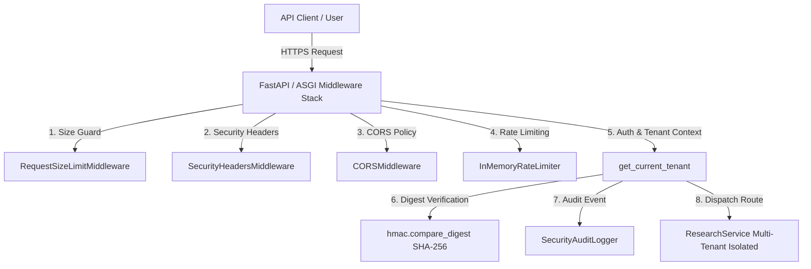

# Phase 7.2 Architecture & Security Documentation: Production API Security & Abuse Protection

## 1. Executive Summary

ResearchMind Phase 7.2 introduces production-grade API security, multi-tenant isolation, defense-in-depth input validation, rate limiting, and zero-leakage security audit logging for the deployed ResearchMind service.

All authentication keys are hashed using SHA-256 before storage or comparison, ensuring raw secrets are never logged or persisted in memory structures. API endpoints enforce strict tenant-level authorization to prevent Insecure Direct Object Reference (IDOR) vulnerabilities across research runs, checkpoints, events, dossiers, and persistent artifacts.

---

## 2. Threat Model

Phase 7.2 mitigates the following critical threat vectors:

| Threat Vector | Severity | Mitigation Strategy |
| :--- | :--- | :--- |
| **Credential Leakage in Logs** | CRITICAL | SHA-256 key digest storage; strict audit log sanitization redacting `Authorization`, `X-API-Key`, and secret patterns. |
| **Timing Attacks / Secret Oracle** | HIGH | Constant-time digest verification using `hmac.compare_digest`. |
| **Cross-Tenant IDOR Access** | HIGH | Tenant identity (`TenantContext`) bound to authenticated API keys; automatic 404 filtering on mismatched tenant IDs. |
| **Denial of Service / Abuse** | MEDIUM | Early ASGI `Content-Length` payload limits (HTTP 413) and thread-safe sliding-window rate limiting (HTTP 429). |
| **Cross-Origin / Clickjacking** | MEDIUM | Strict CORS origin verification and mandatory security headers (`X-Frame-Options: DENY`, `X-Content-Type-Options: nosniff`, anti-caching headers). |

---

## 3. Security Architecture & Key Modules



### Key Security Modules

1. **`app.security.auth`**:
   - `TenantContext`: Container holding stable `tenant_id` and optional `key_id`.
   - `compute_key_digest`: Converts raw API key strings to 32-byte SHA-256 binary digests.
   - `get_current_tenant`: FastAPI dependency resolving caller identity via constant-time digest comparison.
   - `validate_api_key_constant_time`: Helper for secret verification using `hmac.compare_digest`.

2. **`app.security.audit`**:
   - `log_security_event`: Constructs and logs structured `SecurityAuditEvent` records.
   - `sanitize_audit_details`: Sanitizes key-value metadata to prevent secret leakage in logs.
   - Emits standardized audit classifications: `AUTHENTICATION_FAILED`, `AUTHORIZATION_FAILED`, `CROSS_TENANT_ACCESS_DENIED`, `RATE_LIMIT_EXCEEDED`, `PAYLOAD_TOO_LARGE`, `SSRF_BLOCKED`.

3. **`app.security.rate_limiter`**:
   - `InMemoryRateLimiter`: Thread-safe sliding-window counter using monotonic timestamps.
   - Tenant-aware keying: Prefers `tenant:{tenant_id}` over `ip:{client_ip}`.

4. **`app.security.headers`**:
   - `SecurityHeadersMiddleware`: Attaches standard headers plus `Cache-Control: no-store, max-age=0` for REST API endpoints.

5. **`app.security.request_size`**:
   - `RequestSizeLimitMiddleware`: Rejects requests exceeding `MAX_REQUEST_BODY_BYTES` at the ASGI layer with HTTP 413.

---

## 4. Authorization & Tenant Isolation Model

Every authenticated request resolves a stable `TenantContext`:
- In **production** (`API_AUTH_ENABLED=true`), `tenant_id` is derived from the matched API key configured in `API_KEY` or `API_KEYS_JSON`.
- In **development/testing** (`API_AUTH_ENABLED=false`), requests default to `tenant_id="default-tenant"`.

### IDOR Protection Rules

1. **Run Submission**: `POST /api/v1/runs` binds the newly initialized `RunRecord` and `RunContext` to `tenant.tenant_id`.
2. **Resource Retrieval**: `GET /api/v1/runs/{run_id}`, `GET /api/v1/runs/{run_id}/artifacts`, and `GET /api/v1/runs/{run_id}/events` check that `run.tenant_id == caller.tenant_id`. If tenant IDs mismatch, the API returns **HTTP 404 Not Found** (preventing resource enumeration).
3. **Run Cancellation**: `POST /api/v1/runs/{run_id}/cancel` returns **HTTP 404 Not Found** for cross-tenant cancellation requests.

---

## 5. Rate Limiting Design

- **Protocol**: `RateLimiterProtocol` defines the interface for sliding-window counters.
- **In-Memory Default**: `InMemoryRateLimiter` enforces process-local limits safe under high async concurrency using `threading.Lock`.
- **Response Handling**: Rejections return **HTTP 429 Too Many Requests** with `Retry-After: <seconds>` header and structured error body.
- **Distributed Ready**: In multi-instance cluster deployments, `InMemoryRateLimiter` can be swapped with a Redis-backed implementation fulfilling `RateLimiterProtocol`.

---

## 6. CORS & Security Headers Policy

- **CORS**: Configurable via `CORS_ALLOWED_ORIGINS`. Wildcard `*` is filtered and disabled when credentials are enabled.
- **Security Headers**:
  - `X-Content-Type-Options: nosniff`
  - `X-Frame-Options: DENY`
  - `Referrer-Policy: strict-origin-when-cross-origin`
  - `X-XSS-Protection: 0`
  - `Cache-Control: no-store, max-age=0` (attached to `/api/v1/*` responses)
  - `Content-Security-Policy`: Permissive policy compatible with Swagger UI (`/docs`) and ReDoc (`/redoc`).

---

## 7. Configuration Reference

| Environment Variable | Type | Default | Description |
| :--- | :--- | :--- | :--- |
| `API_AUTH_ENABLED` | `bool` | `false` | Enable API-key authentication for protected endpoints. |
| `API_KEY` | `str` | `""` | Primary server API key for Bearer auth. |
| `API_KEYS_JSON` | `str` | `""` | JSON map/list of API keys to tenant identities. |
| `RATE_LIMIT_ENABLED` | `bool` | `false` | Enable sliding-window rate limiting. |
| `RATE_LIMIT_REQUESTS` | `int` | `60` | Max requests allowed per window per tenant/IP. |
| `RATE_LIMIT_WINDOW_SECONDS` | `int` | `60` | Sliding window duration in seconds. |
| `CORS_ALLOWED_ORIGINS` | `str` | `http://localhost:3000...` | Explicit allowed CORS origins (no wildcard). |
| `MAX_REQUEST_BODY_BYTES` | `int` | `1048576` | Max allowed request payload in bytes (1 MiB). |
| `MAX_RESEARCH_GOAL_LENGTH` | `int` | `4000` | Max character length for research goal query. |
| `AUDIT_LOGGING_ENABLED` | `bool` | `true` | Enable structured security audit logging. |

---

## 8. Local Development & Production Deployment Setup

### Local Development (Offline Test Mode)
```bash
# Keep API_AUTH_ENABLED=false for unauthenticated pytest execution
pytest
```

### Production Deployment Setup
```bash
# Set in production environment or Cloud Run / Kubernetes secret
export API_AUTH_ENABLED=true
export API_KEYS_JSON='{"prod-key-alpha-99":"tenant_alpha","prod-key-beta-88":"tenant_beta"}'
export RATE_LIMIT_ENABLED=true
export CORS_ALLOWED_ORIGINS="https://app.researchmind.ai,https://admin.researchmind.ai"
```

---

## 9. Limitations & Future Improvements

1. **Distributed Rate Limiting**: `InMemoryRateLimiter` is process-local. For multi-node scale-out deployments, implement a Redis `ZADD`/`ZREMRANGEBYSCORE` provider implementing `RateLimiterProtocol`.
2. **API Key Lifecycle API**: Currently, key-to-tenant mappings are defined via environment configuration (`API_KEYS_JSON`). Dynamic key issuance and rotation can be introduced in a future admin portal phase.
