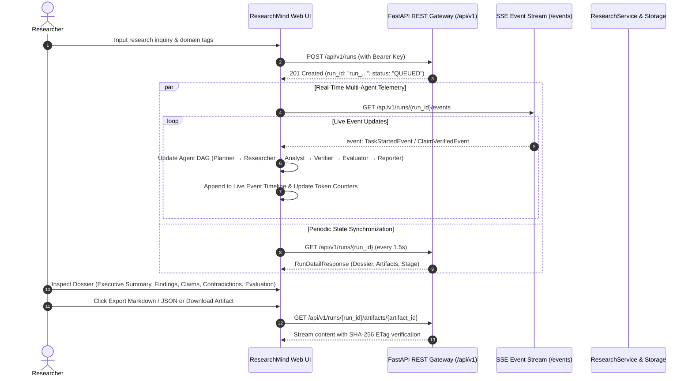

# Phase 7.3 Architecture & Implementation Documentation: Interactive Research Workspace & Live Multi-Agent Execution Studio

## 1. Executive Summary

ResearchMind Phase 7.3 delivers a user-facing, high-performance **Interactive Research Workspace & Live Multi-Agent Execution Studio**.

Built with modern semantic HTML5, vanilla CSS custom properties (design tokens), and native ES modules, the frontend directly consumes the hardened REST and Server-Sent Events (SSE) contracts established in Phases 6.1–7.2 without heavy third-party framework dependencies.

---

## 2. Information Architecture & Component Hierarchy

```
frontend/
├── index.html                           # Semantic HTML5 shell
├── css/
│   └── styles.css                       # Design tokens, dark mode, responsive layout
└── js/
    ├── app.js                           # Root application wireup & coordinator
    ├── api.js                           # Type-safe REST & SSE client
    ├── state.js                         # Reactive deterministic state store
    └── components/
        ├── header.js                    # System health, tenant ID & credentials modal
        ├── inquiry_form.js              # Inquiry topic input, domain chips, subtask limits
        ├── agent_dag.js                 # Multi-agent DAG pipeline visualizer & cancel button
        ├── event_log.js                 # Real-time SSE event timeline console
        ├── diagnostics.js               # Run diagnostics, quality score, token metrics
        ├── dossier_viewer.js            # Tabbed ResearchDossier explorer & export tools
        └── artifact_explorer.js         # Durable artifact inspector & SHA-256 downloads
```

---

## 3. End-to-End User Journey & Data Flow



---

## 4. API & Event Contracts Consumed

| Endpoint | Method | Security / Auth | Purpose |
| :--- | :--- | :--- | :--- |
| `/healthz` | `GET` | Public (Unauthenticated) | Probes service liveness & readiness status. |
| `/api/v1/runs` | `POST` | Bearer Token / `X-API-Key` | Submits inquiry, validates length (4000 max), rate limits (60/min). |
| `/api/v1/runs/{id}` | `GET` | Bearer Token / `X-API-Key` | Retrieves run stage, duration, token usage, and compiled `ResearchDossier`. |
| `/api/v1/runs/{id}/events` | `GET` | Bearer Token / `X-API-Key` | Live Server-Sent Events stream yielding typed orchestration lifecycle events. |
| `/api/v1/runs/{id}/cancel` | `POST` | Bearer Token / `X-API-Key` | Triggers cooperative cancellation of in-flight agent subtasks. |
| `/api/v1/runs/{id}/artifacts` | `GET` | Bearer Token / `X-API-Key` | Lists persistent deliverables with SHA-256 checksums. |
| `/api/v1/runs/{id}/artifacts/{art_id}` | `GET` | Bearer Token / `X-API-Key` | Streams raw report or snapshot payload. |

### SSE Lifecycle Events Handled
- `RunStartedEvent`: Initiates run context and total task estimation.
- `TaskScheduledEvent`: Queues agent role (`Planner`, `Researcher`, `Analyst`, `Verifier`, `Evaluator`, `Reporter`).
- `TaskStartedEvent`: Transitions active agent card into running/pulsing state.
- `TaskCompletedEvent`: Increments completed task count and captures duration/token usage.
- `TaskFailedEvent`: Flags worker failure and triggers retry backoff indicators.
- `RunCompletedEvent`: Completes pipeline and unlocks full Dossier tabs.
- `RunCancelledEvent`: Marks pipeline as cancelled and updates diagnostics.

---

## 5. Security & Credential Management

1. **In-Memory Default**: API keys entered via the settings modal are retained only in memory during the active session.
2. **Optional Session Storage**: Users may explicitly opt into storing credentials in `sessionStorage` (cleared immediately when the browser tab closes).
3. **Zero Secret Leakage**: Raw API keys are never rendered in the DOM, never displayed in cleartext, and never printed to console logs. The UI displays only a masked representation (e.g. `sk-a••••99f`).
4. **Zero Bypass**: All frontend requests pass through the Phase 7.2 constant-time SHA-256 digest authentication and IDOR tenant boundary.

---

## 6. Responsive Design & Accessibility

- **Breakpoints**: Optimized for 1440px desktop, 1024px tablet, 768px small tablet, and 390px mobile screens.
- **Accessibility**:
  - High-contrast text against dark backgrounds (`#0b0f17` background with `#f8fafc` text).
  - Proper label associations (`for` attributes on all inputs).
  - Clear focus outlines on interactive controls.
  - Semantic HTML5 sectioning (`<header>`, `<section>`, `<form>`, `<textarea>`).
  - Reduced motion friendly transitions.

---

## 7. Local Development & Production Serving

### Local Development Mode
```bash
# Start backend server with frontend mounting enabled
uvicorn app.api.app:create_app --factory --host 0.0.0.0 --port 8080 --reload

# Access workspace in browser
open http://localhost:8080/
```

### Production Deployment Configuration
```bash
export SERVE_FRONTEND=true
export API_AUTH_ENABLED=true
export CORS_ALLOWED_ORIGINS="https://researchmind.ai,http://localhost:8080"
```

---

## 8. Verification & Quality Gates

- **Unit & Contract Tests**: `test_frontend_contracts.py` validates all required frontend files and asset integrity.
- **Integration Tests**: `test_frontend_serving_e2e.py` verifies root `/` HTML serving, static CSS/JS routing, and API endpoint precedence.
- **Full Test Suite**: All 840+ unit and integration tests passing.
- **Type Safety & Linting**: Mypy and Ruff 100% green.
