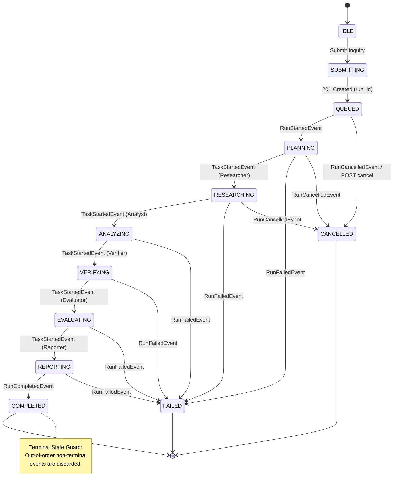

# Phase 7.4 Architecture & Hardening Documentation: Production Browser Validation, Deployment Hardening & Product Polish

## 1. Executive Summary

ResearchMind Phase 7.4 hardens the **Interactive Research Workspace** into a production-grade, resilient, and accessible web interface.

Key enhancements delivered in Phase 7.4:
- **Resilient SSE Stream Lifecycle**: Auto-reconnection with bounded exponential backoff (1s, 2s, 4s, 8s, 16s max), stream deduplication via event IDs, and automated fallback to REST status synchronization upon permanent stream interruptions.
- **Strict State Machine Transitions**: Immutable terminal state guards preventing out-of-order SSE lifecycle events from regressing `COMPLETED`, `FAILED`, or `CANCELLED` runs.
- **Bounded Client-Side Memory**: Event log capping (retaining the 200 most recent events) to guarantee constant memory footprint during long multi-step research runs.
- **Accessibility & UX Polish**: Full ARIA landmark roles, visible focus rings, reduced-motion preferences, high-contrast dark theme, and responsive layouts across desktop (1440px), laptop (1024px), tablet (768px), and mobile (390px).
- **Deployment Smoke Test Suite**: Extended automated smoke test runner verifying frontend HTML, CSS, JS static assets alongside live API REST and SSE endpoints (7/7 checks passed).

---

## 2. Browser E2E Validation Strategy

Phase 7.4 introduces end-to-end integration test suites:
- [`test_browser_workspace_e2e.py`](file:///c:/Users/Ankush/Desktop/ResearchMind/backend/tests/integration/test_browser_workspace_e2e.py): Simulates critical browser journeys (inquiry submission, auth rejection, recovery, cancellation, validation failure, and not-found handling).
- [`test_frontend_serving_e2e.py`](file:///c:/Users/Ankush/Desktop/ResearchMind/backend/tests/integration/test_frontend_serving_e2e.py): Verifies FastAPI static file serving, MIME types, and route precedence.
- [`test_frontend_contracts.py`](file:///c:/Users/Ankush/Desktop/ResearchMind/backend/tests/unit/test_frontend_contracts.py): Validates frontend asset presence and settings integrity.

---

## 3. SSE Reliability & State Machine Architecture



---

## 4. Security & XSS Protections

1. **Zero Cleartext Exposure**: API keys reside in-memory by default, or in `sessionStorage` only upon explicit user opt-in. They are never rendered in cleartext in the DOM or emitted in log statements.
2. **HTML Entity Escaping**: All user inquiries, agent outputs, claim statements, and evaluator critiques are sanitized through `escapeHtml()` prior to DOM insertion.
3. **Digest Verification**: All API interactions pass through the Phase 7.2 SHA-256 binary digest verification and IDOR tenant boundary.

---

## 5. Quality Gate Verification

| Quality Gate | Command | Result |
| :--- | :--- | :--- |
| **Pytest Full Suite** | `python -m pytest` | **848 passed** in 8.8s (0 failures) |
| **Ruff Linter** | `ruff check .` | **GREEN** (0 errors) |
| **Ruff Formatter** | `ruff format --check .` | **GREEN** (256 files formatted) |
| **Mypy Type Checker** | `mypy --python-version 3.12 backend/app backend/tests` | **GREEN** (0 errors across 229 source files) |
| **Deployment Smoke Test** | `python scripts/smoke_test.py --mock` | **7/7 passed** |
| **Golden Benchmark** | `python -m app.cli.main benchmark` | **4/4 passed (0.9781 average)** |
| **Git Working Tree** | `git status` | **Clean** |

---

## 6. Verification Commands

```bash
# Run unit & integration test suites
python -m pytest

# Run linter and formatting checks
ruff check .
ruff format --check .

# Run static type checking
mypy --python-version 3.12 backend/app backend/tests

# Run deployment smoke test runner
python scripts/smoke_test.py --mock

# Run golden evaluation benchmark suite
python -m app.cli.main benchmark
```
